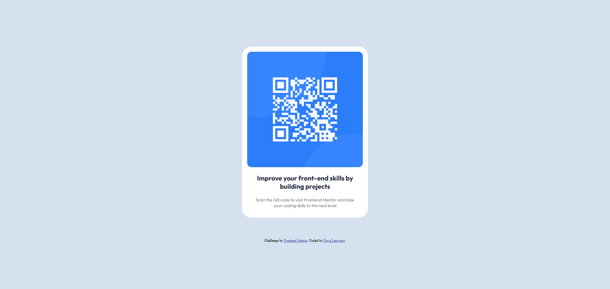

# Frontend Mentor - QR code component solution

This is a solution to the [QR code component challenge on Frontend Mentor](https://www.frontendmentor.io/challenges/qr-code-component-iux_sIO_H). Frontend Mentor challenges help you improve your coding skills by building realistic projects.

## Table of contents

- [Overview](#overview)
  - [Screenshot](#screenshot)
  - [Links](#links)
- [My process](#my-process)
  - [Built with](#built-with)
  - [What I learned](#what-i-learned)
  - [Continued development](#continued-development)
- [Author](#author)

**Note: Delete this note and update the table of contents based on what sections you keep.**

## Overview

### Screenshot

### Links

- Solution URL: [Solution URL](https://www.frontendmentor.io/solutions/responsive-qr-page-using-flexbox-DnpMonP31O)
- Live Site URL: [Live Site](https://qr-code-component-rust-mu.vercel.app/)

## My process

### Built with

- HTML5 markup
- Customized CSS
- Flexbox

### What I learned

Use this section to recap over some of your major learnings while working through this project. Writing these out and providing code samples of areas you want to highlight is a great way to reinforce your own knowledge.

- Image Customization
- Font Styling
- Flexbox Control

### Continued development

I would love continue learning how Grid positioning works.

## Author

- Website - [Dave Miller Lapojapo](https://www.your-site.com)
- Frontend Mentor - [@DaveLaj](https://www.https://www.frontendmentor.io/profile/DaveLaj)
- Twitter - [@dmlapojapo](https://www.linkedin.com/in/dmlapojapo/)

**Note: Delete this note and add/remove/edit lines above based on what links you'd like to share.**
